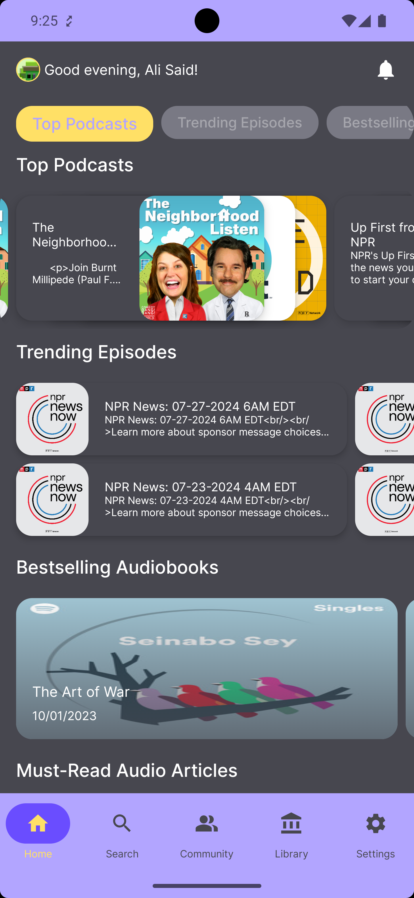
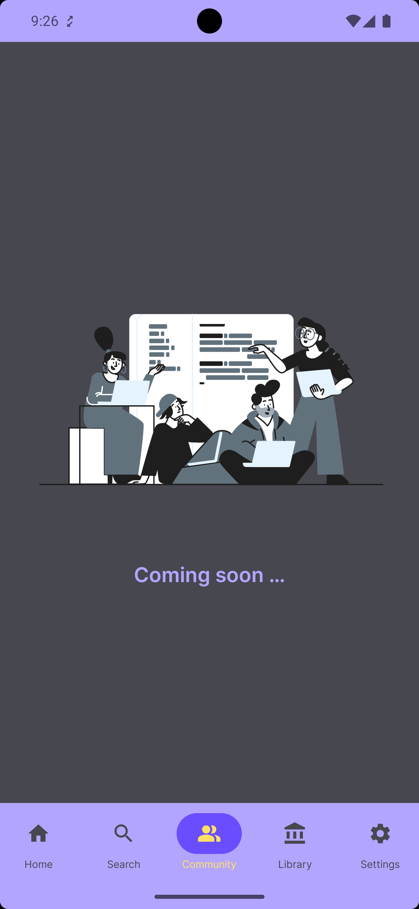
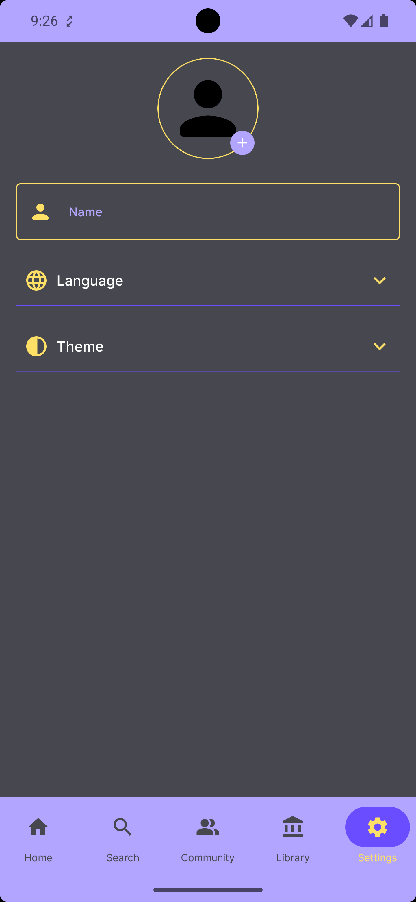

# 🎧 Pulse

A modern Android application built with **Jetpack Compose**, **Kotlin**, and a clean architecture approach. **Pulse** serves as a modular, scalable, and production-ready base for audio-focused content such as **Podcasts**, **Audio Articles**, **Audiobooks**, and **Episodes**.

## 📝 Solution Overview
# ✅ Approach Summary

To solve the task, I structured the app using MVVM with Clean Architecture, ensuring modularity and scalability.

The Home Screen displays sections dynamically based on the response from the /home_sections API. Each section is rendered differently based on its contentType (grid, horizontal list, etc.).

Implemented infinite scrolling using LazyColumn and pagination logic to handle future expansion.

Content rendering is driven by the backend response (sectionType, contentType, order).

Built a search screen using a debounce mechanism (200ms) to reduce unnecessary API calls via Flow.debounce() and distinctUntilChanged().

All UI is built with Jetpack Compose, with lifecycle-aware ViewModels managing the state using StateFlow.

## ⚠️ Challenges Faced
Dynamic section rendering: Mapping API-driven data structure into multiple Compose layouts required careful separation and clean design patterns.

Pagination without backend support: As the provided endpoint treats the whole screen as a single dataset, I implemented a smart callback with debounce to handle paginated APIs.

Debounced search: Ensuring debounced text input and clean cancellation of previous jobs in Compose required custom LaunchedEffect handling tied to TextField state.

##💡 Improvements & Ideas

Add a local caching mechanism using Room or DataStore for offline mode or faster reloads.

Enhance user experience with:

 - Content filtering (e.g., Podcasts only)
 - Impelement more feature such as community and library 

---

## 🚀 Tech Stack

| Layer       | Tech & Tools |
|-------------|--------------|
| **Language**      | Kotlin 2.2.0 |
| **UI Toolkit**    | Jetpack Compose (BOM 2025.07.00) |
| **DI**            | Hilt 2.56.2 + Hilt Navigation Compose |
| **Networking**    | Retrofit 3.0.0 + LoggingInterceptor + Chucker |
| **Async / Flow**  | Kotlin Coroutines 1.10.2 |
| **Persistence**   | DataStore |
| **Image Loading** | Coil 2.7.0 |
| **Security**      | Google Tink 1.18.0 |
| **Serialization** | Gson + Kotlinx Serialization |
| **Testing**       | JUnit, Espresso, MockK, Turbine |

---

## 🧱 Architecture

**Modular Clean Architecture** with separation of concerns:

## 📁 Project Structure

```text
📦 Pulse/
├── app/
│   └── ui/                        # Presentation layer (screens and ViewModels)
│
├── core/
│   ├── data/                      # Data layer implementations
│   │   ├── dataSource/            # Abstract data sources
│   │   ├── local/                 # Local storage (DataStore)
│   │   ├── remote/                # API communication
│   │   └── di/                    # Hilt modules and dependency injection
│   │
│   ├── domain/                    # Business logic layer
│   │   ├── useCases/              # Use case classes
│   │   ├── appConstants/          # Constants and config values
│   │   └── utils/                 # General-purpose tools
│   │
│   └── ui/                        # Shared Jetpack Compose UI and base ViewModels
``` 

- Follows **MVVM + Clean Architecture**
- **State management** using Kotlin `Flow` and `StateFlow`
- **Composable Navigation**
- Fully scalable and testable

---

## 🖼️ UI Features

- 🎙️ Browse Podcasts, AudioBooks, Episodes, and Audio Articles
- 🎨 Dynamic theming using Palette API
- 🔄 Lottie animations for smooth UI interactions

---

## 🧪 Testing

### Included Testing Stack

| Tool       | Usage |
|------------|-------|
| `JUnit` | Unit testing |
| `Espresso` | UI Testing |
| `MockK` | Mocking dependencies |
| `Turbine` | Flow testing |
| `core-testing` | LiveData / Architecture components |
| `kotlinx.coroutines.test` | Coroutine testing |

---

## 🧩 Modular & Scalable

The app is designed to support modularity and separation of concerns:

- Feature modules can be added easily (e.g., feature-auth, feature-profile)
- Shared UI and core utilities are reusable
- Each domain layer can be tested independently

---

👨‍💻 Author
Mohamed Emish

Senior Android Engineer

📍 Riyadh, Saudi Arabia

📧 Emish52020@gmail.com

---

## 📸 Screenshots





